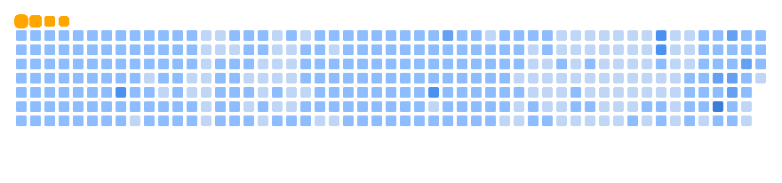

# Hi, I'm Nalin 👋

I build things that actually get used, and I contribute to open source because it's fun.
Doing it all for the love of the game.

**Tech:** Node.js · React · TypeScript · PostgreSQL · WebSockets · Docker · Redis · Kafka · AWS · Rust

**Find me:** [Twitter/X](https://x.com/nalin82929) · [Site](https://nalin.nerdev.in) · [LinkedIn](https://lnkd.in/nalin-dalal) · [Email](mailto:nalin@nerdev.in)

---

## 🏗️ Production Work

- **[CoDraw](https://codraw.nerdev.in)** — Self-hostable real-time collaborative whiteboard. Diff-based real-time sync, room-based auth, optimistic concurrency. Built it because I wanted an Excalidraw I could self-host. Turborepo monorepo: Next.js + Bun HTTP/WebSocket. [Read more](https://nalin.nerdev.in/projects/codraw/).
- **[Modheshwari](https://modheshwari.nerdev.in)** — Full-stack community management platform. I own the deploy pipeline here: hardened CI/CD rollback, fixed build-blocking type errors, automated Postgres backups on a 9-container Docker stack (Next.js + Bun/Elysia + Kafka + Redis + Neon) on EC2. [Read more](https://nalin.nerdev.in/projects/modheshwari/).

---

## 🌱 Open Source

27 merged PRs across processing/p5.js, p5.js-website, and asyncapi/generator.

- **[processing/p5.js](https://github.com/processing/p5.js)** — Framebuffer texture size fix, accessibility improvements for `describe()`
- **[processing/p5.js-website](https://github.com/processing/p5.js-website)** — HTML compliance fixes, auto-close issues workflow, Hindi translation
- **[asyncapi/generator](https://github.com/asyncapi/generator)** — Unit tests for `getDirElementsRecursive`

Full list: [`prs.md`](./prs.md)

---

## 🔨 Currently Exploring

- **ML + product-level builds** — Studying machine learning, but learning by building real stuff, not just notebooks. Current: **PlayMesh**, a real-time multiplayer games platform over WebRTC data channels (game state sync, leaderboards, on-call play). Golang backend, TypeScript frontend. Source: [nerdev-co/playmesh](https://github.com/nerdev-co/playmesh).

---

---

_[Resume](./Resume.pdf)_