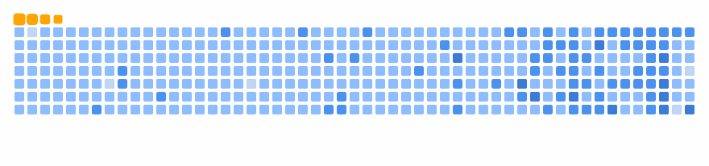

21, Engineer
 
I like to build stuff
I love to solve tough problems

<!-- PRS-START -->

📊 Total Merged PRs: 15 | Open PRs: 5

## ✅ Merged PRs
- **[Bounty: Use SVG's for common cursors (Custom cursor functionality) #630](https://github.com/CapSoftware/Cap/pull/722)**  
  _CapSoftware/Cap_ • `2025-08-04T11:31:19Z`  
  > Bounty: Use SVG's for common cursors (Custom cursor functionality) #630.

- **[removed node modules, updated gitignore](https://github.com/samarth-na/deno/pull/1)**  
  _samarth-na/deno_ • `2025-07-30T17:37:52Z`  
  > Removes deprecated or redundant code.

- **[solves docs issue 837 for p5.js 2.x](https://github.com/processing/p5.js-website/pull/879)**  
  _processing/p5.js-website_ • `2025-07-17T23:18:13Z`  
  > solves docs issue 837 for p5.js 2.x.

- **[made the login page, made it pixel-perfect](https://github.com/Nexacore-Org/ByteChain-Academy/pull/26)**  
  _Nexacore-Org/ByteChain-Academy_ • `2025-03-23T17:30:27Z`  
  > made the login page, made it pixel-perfect.

- **[Tried something for Solidity LSP](https://github.com/samarth-na/nvim/pull/4)**  
  _samarth-na/nvim_ • `2024-12-12T13:56:38Z`  
  > Tried something for Solidity LSP.

- **[Added live server for web2 projects.](https://github.com/samarth-na/nvim/pull/3)**  
  _samarth-na/nvim_ • `2024-12-03T16:41:14Z`  
  > Adds a new feature.

- **[team members added](https://github.com/Nev-Labs/Website/pull/3)**  
  _Nev-Labs/Website_ • `2024-10-02T16:29:14Z`  
  > team members added.

- **[updated poster](https://github.com/Nev-Labs/Website/pull/2)**  
  _Nev-Labs/Website_ • `2024-09-30T09:04:45Z`  
  > Updates existing functionality.

- **[Added discord](https://github.com/Nev-Labs/Website/pull/1)**  
  _Nev-Labs/Website_ • `2024-09-30T02:15:51Z`  
  > Adds a new feature.

- **[frontend connectivity](https://github.com/Trisha-tech/OnlineBookSales/pull/161)**  
  _Trisha-tech/OnlineBookSales_ • `2024-06-12T04:10:31Z`  
  > frontend connectivity.

- **[Day 07 added](https://github.com/subhadipbhowmik/30-Days-Of-CPP/pull/155)**  
  _subhadipbhowmik/30-Days-Of-CPP_ • `2024-06-09T09:31:59Z`  
  > Day 07 added.

- **[loader improved](https://github.com/VaibhavArora314/StyleShare/pull/89)**  
  _VaibhavArora314/StyleShare_ • `2024-06-03T11:52:39Z`  
  > loader improved.

- **[added the docker file along with the documentation](https://github.com/heysubinoy/clippy/pull/33)**  
  _heysubinoy/clippy_ • `2024-06-03T10:03:23Z`  
  > Adds a new feature.

- **[commands.md](https://github.com/samarth-na/nvim/pull/1)**  
  _samarth-na/nvim_ • `2024-05-25T17:21:37Z`  
  > commands.md.

- **[c++ code](https://github.com/samarth-na/clang/pull/1)**  
  _samarth-na/clang_ • `2024-04-08T19:19:49Z`  
  > c++ code.

## 🟡 Open PRs
- **[test: add unit tests for `getDirElementsRecursive`](https://github.com/asyncapi/generator/pull/1679)**  
  _asyncapi/generator_ • `2025-08-21T10:04:50Z`  
  > test: add unit tests for `getDirElementsRecursive`.

- **[Auto-link / Close Issues for 2.0 PRs (p5.js & p5.js-website)](https://github.com/processing/p5.js/pull/8025)**  
  _processing/p5.js_ • `2025-08-08T07:15:55Z`  
  > Auto-link / Close Issues for 2.0 PRs (p5.js & p5.js-website).

- **[Auto-link / Close Issues for 2.0 PRs (p5.js & p5.js-website)](https://github.com/processing/p5.js-website/pull/919)**  
  _processing/p5.js-website_ • `2025-07-26T12:16:30Z`  
  > Auto-link / Close Issues for 2.0 PRs (p5.js & p5.js-website).

- **[refactor: optimize directory traversal in check-edit-links script](https://github.com/asyncapi/website/pull/4126)**  
  _asyncapi/website_ • `2025-05-25T11:50:09Z`  
  > Improves internal code structure.

- **[ci/cd pipeline](https://github.com/Mentro-Org/CodeLookout/pull/27)**  
  _Mentro-Org/CodeLookout_ • `2025-05-25T18:38:05Z`  
  > ci/cd pipeline.

<!-- PRS-END -->
