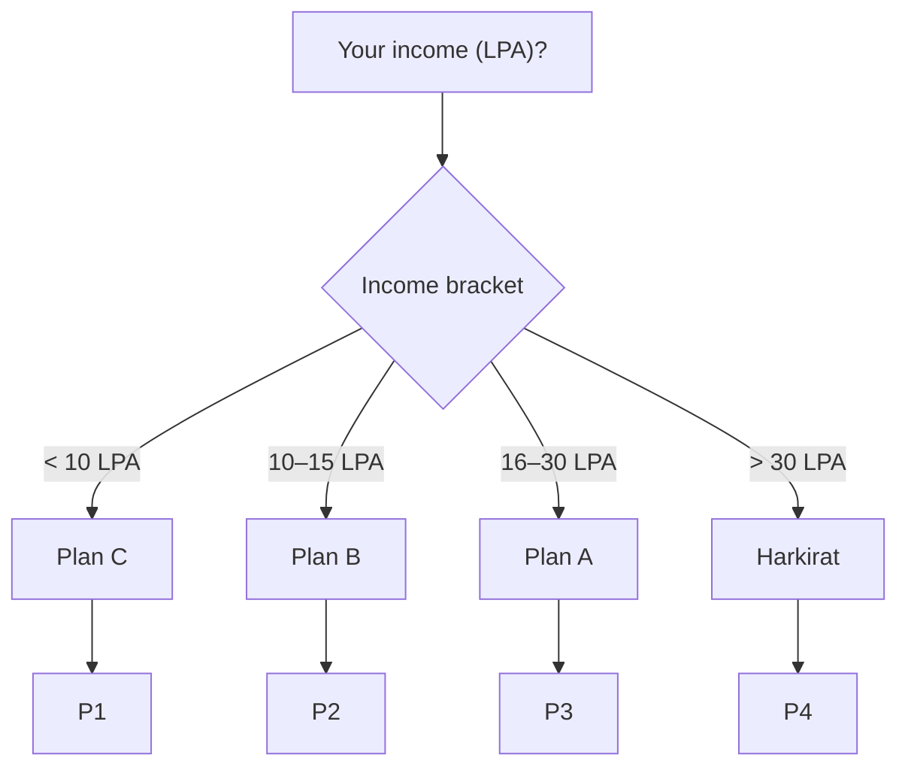
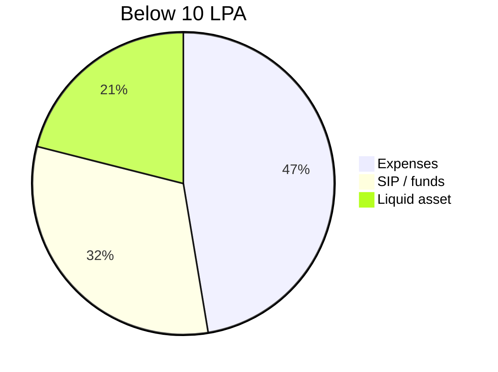
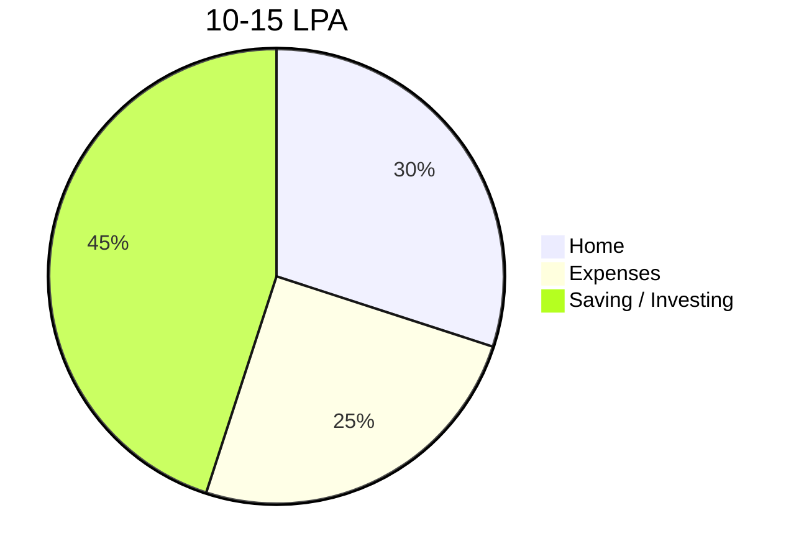
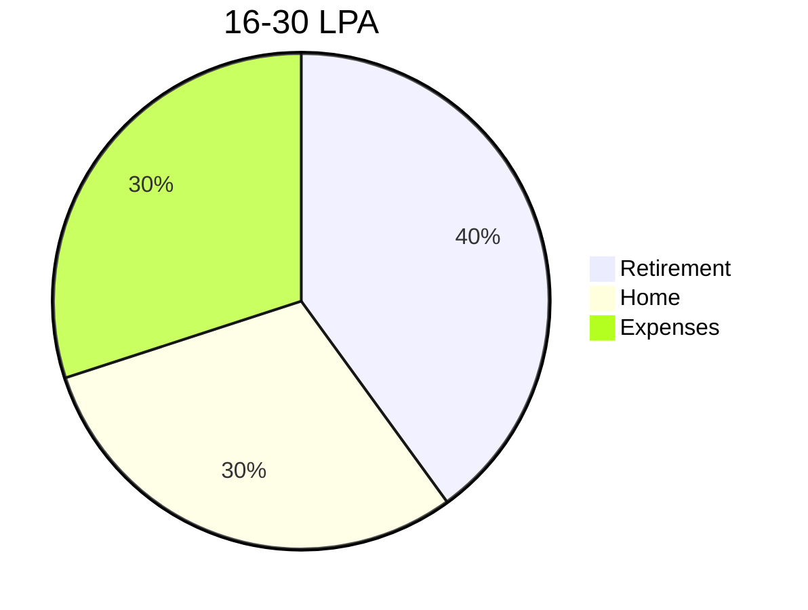
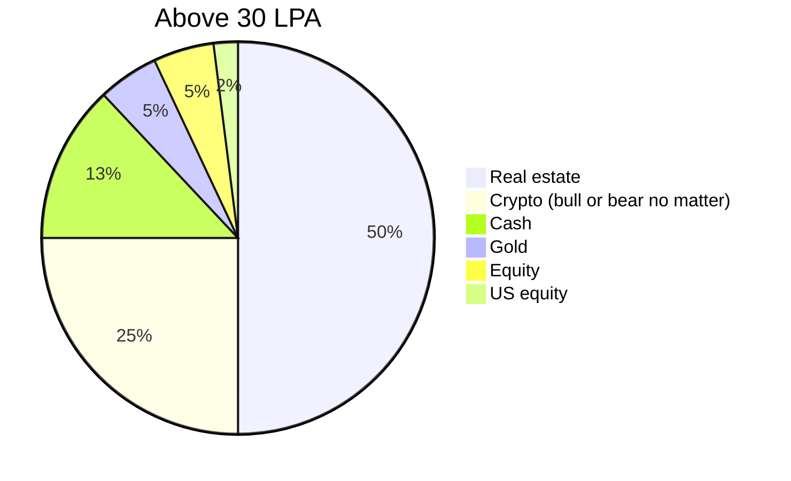

# Income Distribution

How much goes to savings, expenses, and other buckets — by income bracket.

## Bracket Selector

## Plan C — below 10 LPA

Lean survival: fixed costs eat the most, minimum forced savings.

## Plan B — 10–15 LPA

Savings-first: biggest single bucket goes to saving/investing.

## Plan A — 16–30 LPA

Retirement-first: retirement + home dominate, expenses capped at a third.

## Harkirat — above 30 LPA

Asset-allocation heavy: no fixed savings/expense split, everything is capital.

